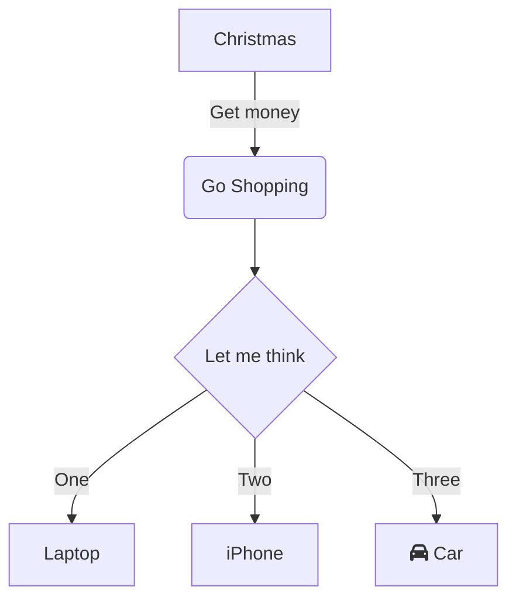
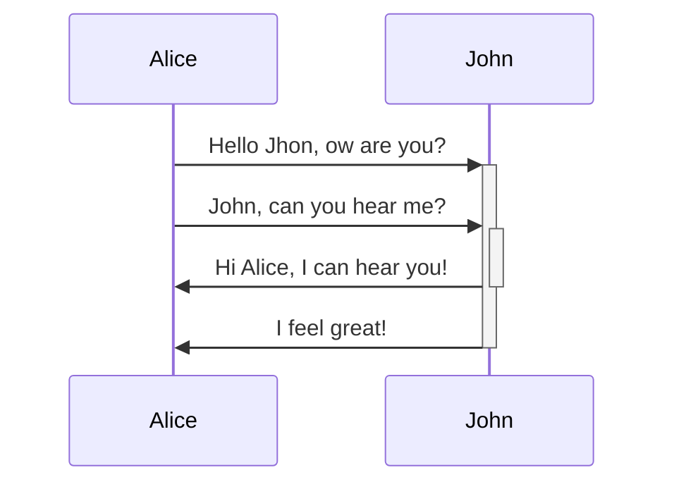
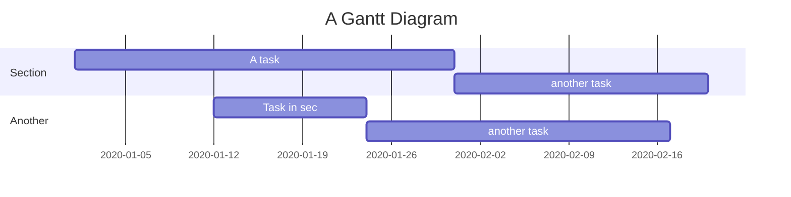

마크다운 문법을 다시한번 정리

**목차**  
# 목차 만들기  
```
[[_TOC_]]
```

[[_TOC_]]  
# 헤더  
```
# H1 헤더
## H2 헤더
### H3 헤더
#### H4 헤더
##### H5 헤더
###### H6 헤더
####### H7 헤더는 없다
```

# H1 헤더
## H2 헤더
### H3 헤더
#### H4 헤더
##### H5 헤더
###### H6 헤더
####### H7 헤더는 없다

# 목록
## 순서가 필요한 목록
```
1. 리스트1
    1. 서브리스트1
    1. 서브리스트2
    1. 서브리스트3
1. 리스트2
    1. 서브리스트1
        1. 서서브리스트1
        1. 서서브리스트2
        1. 서서브리스트3
        1. 서서브리스트4
    1. 서브리스트2
    1. 서브리스트3
        1. 서서브리스트1
        1. 서서브리스트2
1. 리스트3

```
1. 리스트1
    1. 서브리스트1
    1. 서브리스트2
    1. 서브리스트3
1. 리스트2
    1. 서브리스트1
        1. 서서브리스트1
        1. 서서브리스트2
        1. 서서브리스트3
        1. 서서브리스트4
    1. 서브리스트2
    1. 서브리스트3
        1. 서서브리스트1
        1. 서서브리스트2
1. 리스트3

## 순서가 필요없는 목록
```
- 리스트
  - 서브리스트
    - 서서브리스트
    - 서서브리스트
  - 서브리스트
  - 서브리스트
* 리스트
  * 서브리스트
    * 서서브리스트
    - 서서브리스트
  + 서브리스트
  - 서브리스트
+ 리스트

```
- 리스트
  - 서브리스트
    - 서서브리스트
    - 서서브리스트
  - 서브리스트
  - 서브리스트
* 리스트
  * 서브리스트
    * 서서브리스트
    - 서서브리스트
  + 서브리스트
  - 서브리스트
+ 리스트

# 서식
```
※ 개행을 위해서는 마지막에 스페이스를 두번 붙이면 된다  
~~취소선~~  
_이탤릭_  
**강조**  
***강조 이탤릭***  
상단기호<sup>상단</sup>  
하단기호<sub>하단</sub>  
> Blockquotes  
>> Blockquotes  

```
※ 개행을 위해서는 마지막에 스페이스를 두번 붙이면 된다  
~~취소선~~  
_이탤릭_  
**강조**  
***강조 이탤릭***  
상단기호<sup>상단</sup>
하단기호<sub>하단</sub>  
> Blockquotes  
>> Blockquotes  

# 링크
```
[링크](https://www.google.com)  
[내부링크](/그어딘가)  
<https://cholchori.github.io>  
[링크설명](https://cholchori.tistory.com "다른 홈페이지로 이동합니다")
```
[링크](https://www.google.com)  
[내부링크](/그어딘가)  
<https://cholchori.github.io>  
[링크설명](https://cholchori.tistory.com "다른 홈페이지로 이동합니다")


# 이미지
```
링크와 비슷(앞에 !가 붙음)  
이미지   
이미지 링크 [](https://cholchori.tistory.com "다른 홈페이지로 이동")  

```

링크와 비슷(앞에 !가 붙음)  
이미지   
이미지 링크 [](https://cholchori.tistory.com "다른 홈페이지로 이동")  


# 코드블럭
## 인라인 코드
```
`$ rm -rf /`
```
`$ rm -rf /`
## 코드블럭

스페이스 4개를 붙인다   

    <?php
        echo "hello world!";
    ?>
`을 세개 찍는다
```javascript
function test(){
    console.log("hello world!");
}
```

# 테이블

```
헤드1|헤드2
---|---|
내용1|내용2
내용3|내용4

|헤드1|헤드2|
| --- | --- |
|내용1|내용2|
|내용3|내용4|

|왼쪽 정렬|중간정렬|오른쪽 정렬|
| :---    | :---:  |      ---:|
|내용1|내용2|내용3|
|내용4|내용5|내용6|

```

헤드1|헤드2
---|---|
내용1|내용2
내용3|내용4

|헤드1|헤드2|
| --- | --- |
|내용1|내용2|
|내용3|내용4|

|왼쪽 정렬|중간정렬|오른쪽 정렬|
| :---    | :---:  |      ---:|
|내용1|내용2|내용3|
|내용4|내용5|내용6|


# 태스크 리스트  
```
- [ ] 일거리1
    - [ ] 소일거리1
    - [ ] 소일거리2
    - [x] 소일거리3
    - [x] 소일거리4
- [ ] 일거리2
- [ ] 일거리3
- [x] 일거리4

```

- [ ] 일거리1
    - [ ] 소일거리1
    - [ ] 소일거리2
    - [x] 소일거리3
    - [x] 소일거리4
- [ ] 일거리2
- [ ] 일거리3
- [x] 일거리4

# 이모지   
```
: 를 입력하고 알파벳을 놀러 보면 연관 이모지가 선택이 가능하다   
:star: :calendar: :zzz:   

```

: 를 입력하고 알파벳을 놀러 보면 연관 이모지가 선택이 가능하다   
:star: :calendar: :zzz:   

# 도표

<pre>





</pre>


